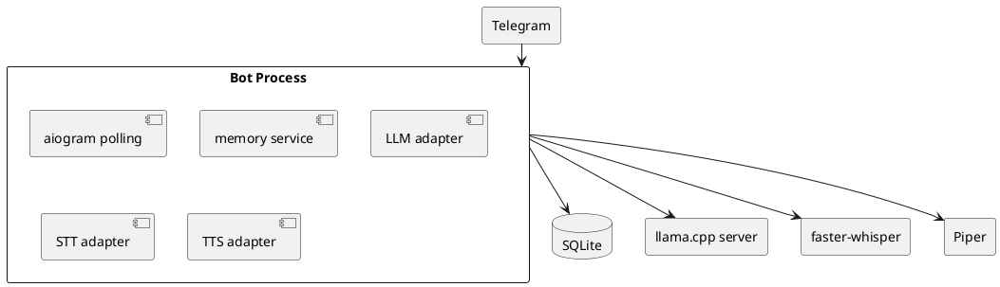

# SPEC-001-Gosha-MVP

## Background

Gosha is a self-hosted Telegram companion for a very small group of trusted users.  
The first version is not about broad functionality. It is about validating conversational comfort:

- Is it pleasant to talk to Gosha in Russian?
- Does voice input/output feel natural enough?
- Does minimal persistent memory make the interaction feel personal?

The deployment target is a single Ubuntu server with CPU-only inference.  
This means the MVP must prioritize low complexity, stable local components, and short response paths.

## Requirements

### Must have
- Telegram bot for 1–3 whitelisted users
- text input and text replies
- voice input and voice replies
- Russian-first conversational behavior
- persistent per-user memory
- strict user isolation
- local CPU-only inference
- local STT
- local TTS
- SQLite as canonical storage
- `systemd` deployment on Ubuntu

### Should have
- short-form profile memory
- rolling conversation summary
- `/start`, `/help`, `/voice_on`, `/voice_off`, `/whoami`, `/memory`
- structured logs
- restart-safe deployment
- basic tests for isolation and voice pipeline

### Could have
- admin-only diagnostics command
- export script for user memory
- manual backup helper

### Won’t have in MVP
- web search
- weather
- books
- music
- transport
- vector DB
- embeddings
- webhook mode
- web admin panel
- FastAPI service
- multi-agent orchestration

## Method

### Canonical stack
- Telegram: `aiogram`
- DB: SQLite with WAL
- LLM runtime: `llama.cpp` HTTP server
- LLM model: `Qwen3-4B` GGUF
- STT: `faster-whisper small` on CPU with `int8`
- TTS: `piper-tts` with one Russian voice
- Audio conversion: `ffmpeg`

### Architectural method

### Retrieval method
For each reply:
1. resolve user
2. load settings
3. load profile facts
4. load rolling summary
5. load recent messages
6. compose prompt
7. call local LLM
8. persist outputs
9. optionally update memory

### Data model
Minimal persistent entities:
- `users`
- `user_settings`
- `messages`
- `profile_facts`
- `daily_summaries`

### Key invariants
- every memory query is scoped by `user_id`
- SQLite is the source of truth
- no cross-user retrieval
- unknown Telegram users are rejected
- assistant replies in Russian unless user explicitly changes language

## Implementation

1. Create repo skeleton.
2. Add `.env.example`, docs, contract and prompt files.
3. Implement config loading and logging.
4. Implement SQLite bootstrap and migrations.
5. Implement Telegram polling bot.
6. Implement text flow with local llama.cpp.
7. Implement voice download and transcription.
8. Implement Piper synthesis and voice replies.
9. Implement minimal memory retrieval and persistence.
10. Add isolation tests and smoke tests.
11. Add `systemd` services.
12. Document local operations.

## Milestones

### M1 — local inference works
- llama.cpp serves the model
- a local curl request returns a Russian answer

### M2 — text chat works
- Telegram text in
- Russian text out
- messages persisted

### M3 — voice works
- voice in
- STT transcript
- voice out

### M4 — memory works
- profile facts survive restart
- rolling summary is reused
- `/whoami` shows stored facts

### M5 — deployment is stable
- systemd restart works
- logs are readable
- backup command works

## Gathering Results

Evaluate with real usage for at least 3–5 days.

Track:
- median text reply latency
- median voice reply latency
- STT failure rate
- TTS failure rate
- visible memory usefulness
- any cross-user leakage incidents
- user comfort feedback

Success means:
- users prefer interacting with the bot over a stateless baseline
- latency is acceptable enough for daily casual use
- memory improves conversation quality without obvious hallucination
- the deployment can survive restarts without data loss

## Need Professional Help in Developing Your Architecture?

Please contact me at [sammuti.com](https://sammuti.com) :)
