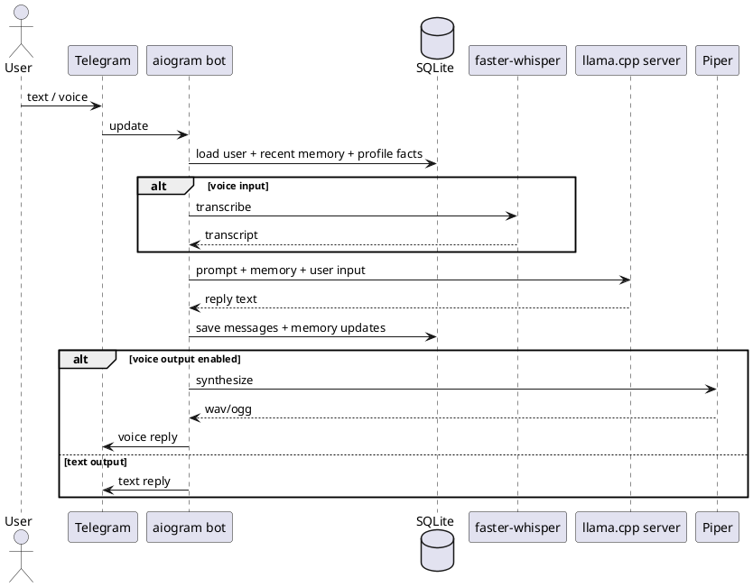

# Gosha MVP — Architecture

## High-level architecture



## Components

### 1. Telegram bot process
Responsibilities:
- receive updates by long polling
- whitelist check
- user lookup / creation
- route text vs voice flow
- call LLM/STT/TTS adapters
- persist messages and memory

### 2. SQLite database
Stores:
- users
- settings
- messages
- profile facts
- rolling summaries

### 3. llama.cpp server
Responsibilities:
- local inference
- short Russian chat replies
- optional structured memory extraction

### 4. faster-whisper
Responsibilities:
- transcribe Telegram voice messages to text

### 5. Piper
Responsibilities:
- synthesize short Russian voice replies

## Message flow

### Text flow
1. Receive Telegram text update
2. Map `telegram_user_id -> user_id`
3. Load recent messages + profile facts + latest summary
4. Build prompt
5. Generate assistant reply
6. Save incoming and outgoing messages
7. Optionally extract/update memory
8. Send reply

### Voice flow
1. Receive Telegram voice note
2. Download voice file
3. Convert if needed with `ffmpeg`
4. Transcribe via faster-whisper
5. Reuse normal text flow
6. If voice mode is enabled, synthesize reply with Piper
7. Send voice/audio back

## Minimal repository structure

```text
gosha/
├─ .env.example
├─ README.md
├─ pyproject.toml
├─ docs/
├─ contract/
├─ prompts/
├─ app/
│  ├─ main.py
│  ├─ config.py
│  ├─ bot.py
│  ├─ handlers.py
│  ├─ db.py
│  ├─ memory.py
│  ├─ llm.py
│  ├─ stt.py
│  ├─ tts.py
│  └─ models.py
├─ data/
│  ├─ db/
│  ├─ models/
│  │  ├─ llm/
│  │  └─ tts/
│  ├─ cache/
│  ├─ tmp/
│  └─ logs/
├─ deploy/systemd/
├─ scripts/
└─ tests/
```

## Non-goals for this architecture

Do not add in MVP:
- background job framework
- REST API
- vector search
- multi-model routing
- web scraping
- third-party hosted APIs
- streaming partial replies
