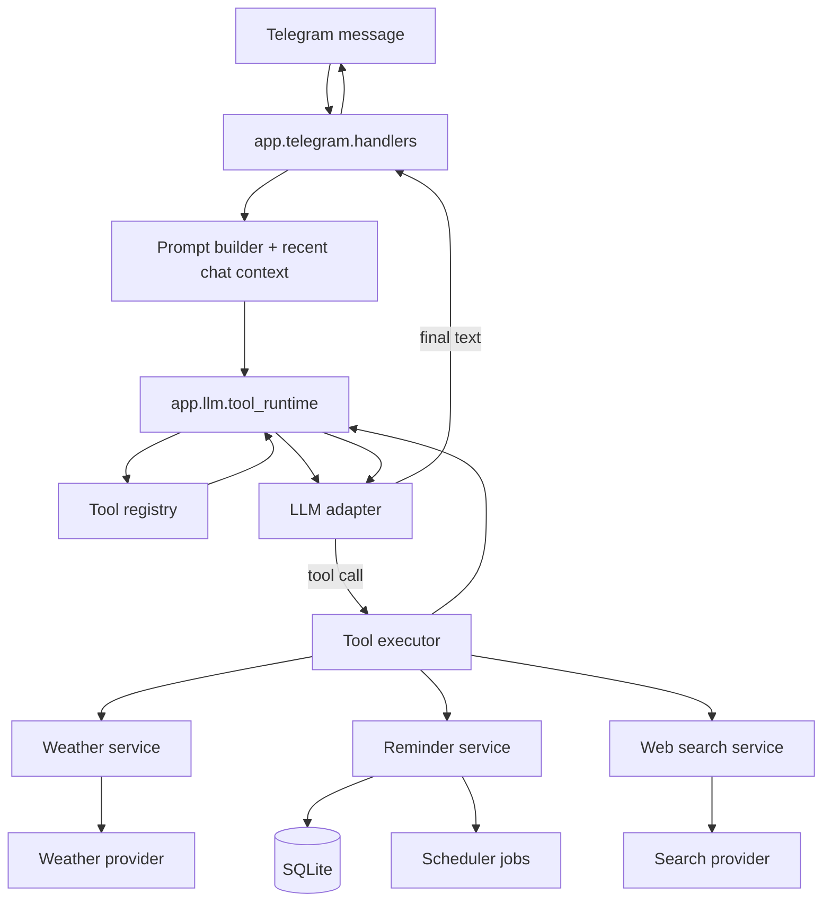

# Gosha MVP — Tools Runtime Architecture (next phase)

> Status: proposed. This document describes the target architecture for the first tools-enabled phase:
> **weather**, **reminders**, and **web search**.
>
> It is intentionally separate from `docs/architecture.md`, which documents the **current** runtime.
> Current repository docs still describe weather/web search as out of scope for the already implemented text-first path.

## 1. Why this document exists

The repository already has a clean text-chat skeleton:
- Telegram polling bot
- provider-agnostic LLM adapters
- SQLite persistence
- text and voice handlers
- jobs directory

That is a good base, but tools add a new problem that does not fit into a single `tools/` folder:

1. the LLM must know which tools exist **for this request**
2. the app must execute tool calls safely
3. tool logic must be separated from provider-specific API clients
4. action tools (especially reminders) must persist state and survive restart
5. Telegram handlers should stay thin and should not know tool internals

This document defines that separation.

## 2. Goals

### In scope
- Add first-class tool support for:
  - weather
  - reminders
  - web search
- Keep Telegram layer thin
- Keep provider-specific code isolated
- Keep current `app/llm/*` abstraction style
- Support multi-step tool loop
- Keep SQLite as canonical storage
- Make reminders restart-safe

### Out of scope
- smart home
- music
- audiobooks
- anti-scam
- generic plugin marketplace
- multi-agent orchestration
- vector retrieval for tools
- arbitrary code execution tools

## 3. Architectural decision

### Chosen approach
Use an **internal tool runtime** inside the existing `app/llm` boundary.

The Telegram layer will continue to ask for "generate reply", but the LLM runtime will be allowed to:
1. receive tool definitions
2. receive model tool calls
3. execute tools via app-side code
4. continue the loop until final assistant text is produced

### Why this approach
It minimizes refactor because the current runtime already has:
- `app/llm/base.py`
- `app/llm/client.py`
- `app/llm/gemini_client.py`
- `app/llm/factory.py`
- `app/telegram/handlers.py` calling a provider-agnostic chat client

So the tools architecture should extend that boundary instead of pushing tool execution into Telegram handlers.

## 4. Core design principles

1. **Tool contract is not business logic**  
   A tool definition is only the interface visible to the model.

2. **Tool handler is thin**  
   It validates input, calls one domain service, and returns structured output.

3. **Service owns business logic**  
   Weather lookup, reminder creation, and web search formatting happen in services.

4. **Provider adapter owns integration details**  
   HTTP requests, API params, auth, retries, and response normalization live in provider modules.

5. **Telegram layer never talks to external APIs directly**  
   Telegram handlers only pass user text into the assistant runtime and return final text/voice.

6. **Reminder state is app state, not model memory**  
   Reminders must be stored in SQLite and scheduled by jobs.

7. **Only relevant tools are exposed per request**  
   Do not pass every possible tool into every model call.

## 5. Proposed runtime flow



## 6. Request lifecycle

### 6.1 Normal text-only request
1. Telegram handler receives a user message.
2. Existing persistence and prompt-building steps run as today.
3. Assistant runtime is called with:
   - messages
   - user context
   - request-scoped tool availability
4. Model returns plain text.
5. Text is persisted and sent to Telegram.

### 6.2 Tool-using request
1. Telegram handler receives a user message.
2. Assistant runtime selects the allowed toolset for this run.
3. Model receives:
   - messages
   - tool definitions
4. Model returns one or more tool calls.
5. Tool runtime validates call names and arguments.
6. Matching tool handler executes domain service.
7. Tool result is appended to model context.
8. Model is called again.
9. Loop continues until final assistant text is returned.
10. Final assistant text is persisted and sent.

## 7. Module layout

Recommended additions and responsibilities:

```text
app/
  llm/
    base.py
    factory.py
    client.py
    gemini_client.py
    tool_runtime.py
    tool_models.py

  tools/
    registry.py
    policies.py
    errors.py
    weather.py
    reminders.py
    web_search.py

  domain/
    services/
      weather_service.py
      reminder_service.py
      web_search_service.py

  integrations/
    weather/
      open_meteo_client.py
    search/
      search_client.py
    scheduler/
      reminder_scheduler.py

  db/
    repositories/
      reminders.py

  jobs/
    reminder_dispatch.py
```

## 8. Responsibilities by layer

### 8.1 `app.telegram.handlers`
Responsibilities:
- accept Telegram input
- load user and recent context
- call assistant runtime
- persist final assistant output
- send final reply

Must not:
- build tool schemas inline
- call weather/search providers directly
- create reminder jobs directly

### 8.2 `app.llm.tool_runtime`
Responsibilities:
- select tools for this request
- call provider adapter with tool definitions
- parse model tool calls
- execute tool handlers
- append tool results to context
- stop only on final assistant text or hard failure

Must not:
- know HTTP details of weather/search providers
- know SQLite table details for reminders

### 8.3 `app.tools.*`
Responsibilities:
- define tool schema visible to model
- validate input
- translate tool input into service call
- return concise structured result

Must not:
- contain business workflows
- make raw SQL queries
- build Telegram responses

### 8.4 `app.domain.services.*`
Responsibilities:
- business logic
- normalization
- domain validation
- provider coordination
- policy checks that are not model-facing

### 8.5 `app.integrations.*`
Responsibilities:
- external API and scheduler interaction
- retries and timeouts
- provider-specific request/response mapping

### 8.6 `app.db.repositories.reminders`
Responsibilities:
- create/read/update/cancel reminders
- list due reminders
- mark reminder delivery status

## 9. Tool contracts

The model should see only small, stable, narrow contracts.

### 9.1 Weather tool

**Name:** `get_weather`

**Purpose:** fetch weather snapshot or short forecast for a place and date.

Suggested input:
- `city: string`
- `date: string | null`
- `part_of_day: "morning" | "afternoon" | "evening" | "night" | null`

Suggested output:
- normalized city name
- local date/time
- temperature
- conditions summary
- precipitation probability
- wind summary
- source timestamp

Notes:
- prefer human-readable normalized output
- avoid passing raw provider payloads back to the model

### 9.2 Reminder tool

**Name:** `create_reminder`

**Purpose:** store a reminder and schedule delivery.

Suggested input:
- `text: string`
- `remind_at_local: string`
- `timezone: string | null`

Suggested output:
- `reminder_id`
- normalized reminder text
- normalized local timestamp
- timezone
- status = `"scheduled"`

Notes:
- if time is ambiguous, the model should ask a follow-up instead of calling the tool
- reminder creation is an action tool, so the output must be explicit and durable

### 9.3 Web search tool

**Name:** `search_web`

**Purpose:** fetch a small set of recent search results for factual/current questions.

Suggested input:
- `query: string`
- `max_results: integer | null`

Suggested output:
- normalized query
- result list with:
  - title
  - url
  - snippet
  - source
- retrieval timestamp

Notes:
- return compact results only
- tool output should be enough for answer synthesis, not a dump of provider HTML

## 10. Tool availability policy

Not every request gets every tool.

`app/tools/policies.py` should decide which tools are exposed for a given run.

Initial policy:
- expose `create_reminder` if message likely contains a reminder request
- expose `get_weather` if message is about current or future weather
- expose `search_web` if the request depends on current external facts
- expose all three if intent is mixed and small ambiguity is acceptable

This policy is app-controlled.  
The model decides **whether to call** a tool, but the app decides **which tools are available**.

## 11. LLM abstraction changes

Current provider abstraction is text-only.  
It should become tools-capable while keeping a simple Telegram-facing API.

Recommended direction:

### 11.1 Extend `app/llm/base.py`
Add types for:
- `ToolDefinition`
- `ToolCall`
- `ToolResult`
- `ToolAwareLLMResponse`

### 11.2 Keep a simple high-level runtime contract
Telegram layer should still call one method such as:

```python
result = await assistant_runtime.generate(messages=..., user_context=...)
```

Where `result` contains:
- final assistant text
- whether any tools were used
- optional execution trace for logs

### 11.3 Provider adapters
Provider-specific adapters should normalize differences between:
- Gemini-style tool calling
- OpenAI-compatible tool calling
- text-only fallback path

This lets the rest of the app remain provider-agnostic.

## 12. Reminder persistence model

Reminders are not ephemeral.

Add a reminders table with fields like:
- `id`
- `user_id`
- `conversation_id`
- `text`
- `scheduled_for_utc`
- `timezone`
- `status` (`scheduled`, `sent`, `cancelled`, `failed`)
- `source_message_id`
- `created_at`
- `sent_at`
- `last_error`

Behavior:
- reminder row is written before schedule confirmation is returned
- scheduler loads due reminders from SQLite
- delivery job sends message to Telegram
- repository marks send success/failure

This guarantees reminders survive restart.

## 13. Scheduling model

Use the existing `app/jobs` area for reminder delivery.

Recommended split:
- `integrations/scheduler/reminder_scheduler.py`  
  Registers and restores jobs.

- `jobs/reminder_dispatch.py`  
  Executes due reminder delivery.

At startup:
1. app loads scheduled reminders from SQLite
2. scheduler restores pending jobs
3. missed reminders are either delivered immediately or marked as missed based on policy

## 14. Error handling rules

### Model/tool errors
- unknown tool name -> log and fail the request safely
- bad tool args -> one retry path if provider supports it
- provider timeout -> return compact failure result to model or graceful user fallback

### Domain errors
- invalid reminder datetime -> ask user follow-up question
- unsupported city resolution -> ask clarifying question
- empty search results -> tell the model that no reliable results were found

### User-facing behavior
Never expose raw stack traces to Telegram users.

## 15. Observability

For every tools-enabled run, log:
- `telegram_user_id`
- provider name
- model name
- tools exposed
- tools called
- per-tool latency
- total loop count
- success/failure
- reminder id if created

This is needed because tool bugs are usually orchestration bugs, not just model bugs.

## 16. Security and safety boundaries

- tools are server-side only
- model cannot invent arbitrary tool names
- model cannot execute arbitrary Python
- reminder tool writes only for current `user_id`
- search/weather providers are allowlisted integrations
- tool outputs are normalized before re-entering model context

## 17. Rollout plan

### Phase A — internal plumbing
- add tool-aware LLM abstractions
- add tool runtime and registry
- keep Telegram reply path unchanged externally

### Phase B — weather + reminder
- implement weather provider
- add reminders table/repository
- add reminder scheduler and delivery job

### Phase C — web search
- add search provider
- add compact result formatter
- add search-specific prompt rules

### Phase D — hardening
- metrics
- tests for tool loop
- restart-safe reminder recovery
- provider failure tests

## 18. Minimum test matrix

### Unit
- tool policy selection
- tool schema validation
- reminder datetime normalization
- service-level provider mapping

### Integration
- model requests weather -> weather tool executes -> final text returns
- model creates reminder -> row saved -> job scheduled
- app restart -> pending reminders restored
- search provider timeout -> graceful answer

### Regression
- text-only requests still work without tools
- voice requests still go through same reply runtime
- non-whitelisted users remain blocked

## 19. Open questions

- Do we implement native provider tool calling first, or wrap with a framework layer later?
- Which search provider becomes the default?
- Should reminder delivery send plain text first, or respect voice-on setting?
- Do we allow cancellation/edit of reminders in the same phase?

## 20. Recommended file name

Place this document at:

`docs/tools-runtime-architecture.md`

Optional follow-up docs update:
- add one link from `docs/architecture.md`
- update `docs/overview.md` to move weather/reminders/search from "out of scope" to "next phase"
- update `docs/roadmap.md` with a new "Tools runtime" phase
